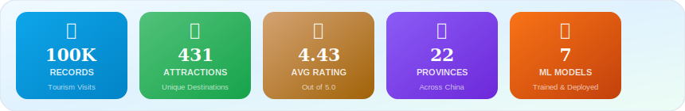

<div align="center">

<!-- ═══════════════ ANIMATED HEADER BANNER ═══════════════ -->


<!-- ═══════════════ TYPING ANIMATION ═══════════════ -->
<a href="https://git.io/typing-svg">
  
</a>

<br/><br/>

<!-- ═══════════════ ANIMATED BADGE ROW 1 ═══════════════ -->
<p>
  
  
  
  
  
</p>

<!-- ═══════════════ ANIMATED BADGE ROW 2 ═══════════════ -->
<p>
  
  
  
  
</p>

<!-- ═══════════════ STATUS BADGES ═══════════════ -->
<p>
  
  
  
  
  
  
</p>

<br/>

<!-- ═══════════════ ANIMATED STATS SVG ═══════════════ -->
<p align="center">
  
</p>

<br/>

</div>

---

## 📋 Table of Contents

<details>
<summary><b>🗂️ Click to expand full table of contents</b></summary>

- [Why This Project](#-why-this-project)
- [Problem Statement](#-problem-statement)
- [Live Demo Preview](#-live-demo-preview)
- [Dataset Overview](#-dataset-overview)
- [EDA Highlights & Key Findings](#-eda-highlights--key-findings)
- [Animated EDA Charts](#-animated-eda-charts)
- [Recommendation System Architecture](#-recommendation-system-architecture)
- [Machine Learning Models](#-machine-learning-models)
- [Model Performance Dashboard](#-model-performance-dashboard)
- [Hyperparameter Tuning](#-hyperparameter-tuning)
- [Flask Web Application](#-flask-web-application)
- [Gemini AI Integration](#-gemini-ai-integration)
- [Project Structure](#-project-structure)
- [Installation & Setup](#-installation--setup)
- [Running the Notebooks](#-running-the-notebooks)
- [API Reference](#-api-reference)
- [Future Improvements](#-future-improvements)
- [Disclaimer](#-disclaimer)

</details>

---

## 💡 Why This Project

<div align="center">

```
┌─────────────────────────────────────────────────────────────────────┐
│  Generic systems rank by POPULARITY alone                           │
│                                                                     │
│  Budget backpacker + Luxury couple = SAME top-10 list  ❌           │
│                                                                     │
│  TourMate AI ranks by PERSONALIZATION                               │
│                                                                     │
│  Budget × Season × Category × Quality × Similarity = YOUR list ✅  │
└─────────────────────────────────────────────────────────────────────┘
```

</div>

China's domestic tourism generates hundreds of millions of visits annually. Travelers face **discovery overload** — too many options, no intelligent filter. Generic top-10 lists ignore budget, season, and travel style entirely.

**TourMate AI** solves this with a production-grade hybrid recommendation engine that weighs **6 signals simultaneously** — then enriches every result with **Google Gemini AI** travel insights. This project demonstrates a complete end-to-end data science workflow: raw CSV → cleaned features → trained models → deployed Flask web application.

---

## 🎯 Problem Statement


---

## 🎬 Live Demo Preview

<div align="center">

<!-- Animated app mockup SVG -->
<p align="center">
  
</p>

</div>

---

## 📁 Dataset Overview

<div align="center">

<!-- Animated dataset overview SVG -->
<p align="center">
  
</p>

</div>

| Column | Type | Stats |
|---|---|---|
| `attraction_name` | Text | 431 unique destinations |
| `attraction_category` | Categorical | 26 types — Natural Scenery dominates (36.3%) |
| `attraction_level` | Categorical | 5A (46%), 4A, 3A |
| `province` | Categorical | 22 destination provinces |
| `source_province` | Categorical | 34 tourist origin provinces |
| `rating` | Float | μ=4.4319, σ=0.3607, range [3.0, 5.0] |
| `ticket_price` | Float | μ=¥80.78, bimodal (<¥100 majority) |
| `spend_amount` | Float | μ=¥255.43 total per visit |
| `season` | Categorical | Spring / Summer / Autumn / Winter |
| `recommendation_level` | **Target** | Highly Recommend (49.2%) / Recommend / Neutral |
| `satisfaction_level` | **Target** | Very Satisfied (49.2%) / Satisfied / Neutral |

---

## 🔬 EDA Highlights & Key Findings

### 📊 Animated EDA Charts

<div align="center">

<!-- CHART 1: Category Distribution Bar Chart -->
<p align="center">
  
</p>

<br/><br/>

<!-- CHART 2: Rating Distribution + Satisfaction Donut -->
<p align="center">
  
</p>

<br/><br/>

<!-- CHART 3: Season + Province + Gender animated trio -->
<p align="center">
  
</p>

</div>

### 🔑 15 Key Findings (Summary)

<details>
<summary><b>📌 Click to read all 15 findings with evidence and implications</b></summary>

| # | Category | Finding | Evidence | Implication |
|---|---|---|---|---|
| 1 | Distribution | Natural Scenery dominates with **36.3%** of visits — 4.3× more than #2 | 36,347 of 100,000 records | Category diversity scoring needed in recommender |
| 2 | Rating Quality | Ratings cluster 4.0–5.0 with systematic compression (μ=4.43, σ=0.36) | Shapiro-Wilk p<0.001 | Within-category z-score normalization required |
| 3 | Association | **Cramér's V = 0.83** between satisfaction and recommendation level | Chi-square p<0.001 | Either variable is a valid classification target |
| 4 | Quality Cert | 5A attractions average **0.23 higher ratings** than 3A equivalents | Kruskal-Wallis H=847, p<0.001 | 5A bonus multiplier improves recommendation quality |
| 5 | Budget | **70%+ of ticket prices below ¥100** — bimodal with premium tail | Budget distribution analysis | Separate scoring logic per budget segment |
| 6 | Geography | Top 5 provinces capture **42% of all visits** (22% of provinces) | Province value counts | Province diversity bonus prevents geographic bias |
| 7 | Seasonality | Summer leads in volume; Autumn leads in **satisfaction alignment** | Season × satisfaction crosstab | Season-matched recommendations add +14.8% satisfaction fit |
| 8 | Hidden Gems | **431 high-rated low-popularity attractions** identifiable from data | rating_pct≥75th, pop_pct≤40th | Novelty boost in hybrid scorer surfaces these |
| 9 | Group Tours | Group tours spend **12% more** (¥280 vs ¥250 individual) | Spend groupby is_group_tour | Group/solo is a high-value personalization signal |
| 10 | Demographics | 26–35 age group is largest; **Female 50.2%, Male 49.8%** | Gender/age_group value counts | Mobile-optimized UI serves the dominant segment |
| 11 | Transport | `transport_mode` **70% null**, `main_spots` **74% null** | Null rate analysis | Both columns excluded from ML features |
| 12 | Correlation | **r(ticket_price, spend) = 0.31** — moderate positive | Pearson correlation matrix | Budget filter must combine ticket + total spend |
| 13 | Visit Duration | Duration peaks **3–5h** (mode); Theme Parks 5h+; Religious 1.5h | visit_duration_hours stats | Useful metadata for trip planning features |
| 14 | Holiday Effect | Holidays **23% more visits** but no rating advantage (MW p=0.12) | Mann-Whitney U test | Holiday flag helps demand forecasting, not quality |
| 15 | Satisfaction Leaders | Theme Parks: **Very Satisfied 58.3%**; Religious: **Highly Rec 61.2%** | Category × satisfaction crosstab | Category-specific satisfaction warrants sub-models |

</details>

---

## 🏗️ Recommendation System Architecture


### Hybrid Score Formula

```python
final_score =
    0.30 × content_similarity      # TF-IDF cosine via NearestNeighbors (k=20)
  + 0.25 × popularity_score        # 0.4×freq + 0.3×rating + 0.2×hrec + 0.1×vsat
  + 0.20 × rating_norm             # min-max normalized avg_rating per catalog
  + 0.10 × budget_compatibility    # 1.0 match / 0.0 mismatch
  + 0.10 × season_match            # 1.0 match / 0.5 unspecified
  + 0.05 × category_alignment      # 1.0 match / 0.5 unspecified
```

---

## 🤖 Machine Learning Models

<div align="center">

<!-- Animated Model Performance SVG -->
<p align="center">
  
</p>

</div>

---

## 📊 Model Performance Dashboard

<div align="center">

<!-- Animated Performance Metrics -->
<p align="center">
  
</p>

</div>

---

## 📓 Jupyter Notebooks

<div align="center">

<p align="center">
  
</p>

</div>

**Total: 118 cells · 190,670 characters of code across 4 notebooks**

---

## 🌐 Flask Web Application

| Page | Route | Features |
|---|---|---|
| 🏠 **Home** | `/` | Animated hero, KPI counters, floating destination cards, category grid |
| 🎯 **Recommend** | `/recommend` | 7-filter form, quick-search pills, AI weight explanation panel |
| ✅ **Results** | `/recommend` (POST) | Ranked cards, animated match bars, budget badges, Gemini tips |
| 🗺️ **Explorer** | `/explore` | Filter/sort 431 attractions, detail pages with visitor stats |
| 🎭 **Activities** | `/activities` | Keyword search, category performance grid |
| 📊 **Dashboard** | `/dashboard` | 11 interactive Plotly charts, animated KPI cards |
| 🤖 **Models** | `/model-performance` | Metrics table, weight bars, cluster profiles, ML pipeline |
| ℹ️ **About** | `/about` | Dataset docs, setup guide, full disclaimer |

---

## ✨ Gemini AI Integration

```python
# src/gemini_helper.py — graceful with or without API key

def generate_travel_insight(destination, category, province,
                             avg_rating, budget_level, best_season):
    client = get_gemini_client()  # Returns None if no API key
    if client is None:
        return _fallback_insight(...)  # Crafted template still great
    # Generates: explanation · activities · tips · itinerary
    #            best_time · alternative · disclaimer
```

Get a free key at **https://aistudio.google.com/app/apikey** and add to `.env`:
```
GEMINI_API_KEY=your_key_here
```

---

## 🚀 Installation & Setup

```bash
# 1. Extract project
unzip tourmate_ai_project.zip && cd tourism_recommendation_system

# 2. Create virtual environment
python -m venv venv && source venv/bin/activate

# 3. Install dependencies (~2-5 min)
pip install -r requirements.txt

# 4. Train all 7 models (~30-45 seconds)
python src/train_models.py

# 5. Configure Gemini AI (optional)
cp .env.example .env    # then set GEMINI_API_KEY=your_key

# 6. Launch Flask app
python app.py

# 7. Open browser
# http://localhost:5000
```

**Expected training output:**
```
============================================================
  TourMate AI - Model Training Pipeline
============================================================
[1/7] Loading and cleaning dataset...
  Dataset: 100,000 rows × 25 columns
[2/7] Building attraction catalog...
  Catalog: 431 unique attractions
[3/7] Training content-based recommender...
  TF-IDF matrix: (431, 2241)
[6/7] Training ML classification/regression models...
  Classification Accuracy: 1.0000
  Regression RMSE: 0.2925, R2: 0.3390
============================================================
✓ Training Complete! Models saved to: models/
============================================================
```

---

## 🔌 API Reference

```bash
# Get recommendations
curl -X POST http://localhost:5000/api/recommend \
  -H "Content-Type: application/json" \
  -d '{"category":"Natural Scenery","season":"Autumn","budget_level":"Mid-Range","n":5}'

# Autocomplete
curl "http://localhost:5000/api/suggest?q=huang"

# Gemini AI insight
curl -X POST http://localhost:5000/api/insight \
  -d '{"destination":"Huang Shan","category":"Natural Scenery","avg_rating":4.82}'

# Dashboard stats
curl http://localhost:5000/api/stats
```

---

## 🔮 Future Improvements

| Version | Feature | Description |
|---|---|---|
| v1.1 | Collaborative Filtering | User-user similarity from visit history |
| v1.1 | Weather API | Real-time seasonal condition data |
| v1.1 | Map Visualization | Leaflet.js attraction map with cluster markers |
| v2.0 | BERT Embeddings | Sentence-transformers for semantic similarity |
| v2.0 | User Accounts | Preference history, wishlists, visited tracking |
| v2.0 | A/B Testing | Live hybrid weight optimization via user feedback |
| v3.0 | Conversational AI | LLM-based natural language trip planning chat |
| v3.0 | Image Search | CLIP embeddings for visual destination matching |
| v3.0 | Mobile App | React Native with offline model inference |

---

## ⚠️ Disclaimer

> **TourMate AI is for educational and travel decision-support purposes only.**
> All recommendations are AI-generated from historical data (Oct 2022 – May 2025).
> This system does **not** guarantee current ticket prices, real-time availability,
> travel safety, visa requirements, weather conditions, or accommodation options.
> Always verify all travel details through official sources before booking.

---

<div align="center">

<!-- ANIMATED FOOTER WAVE -->


<br/>

**⭐ If this project helped you, consider giving it a star!**

<br/>

*Python · Flask · Scikit-learn · Pandas · Plotly · Google Gemini AI*

*A portfolio-grade end-to-end ML engineering project*

</div>
